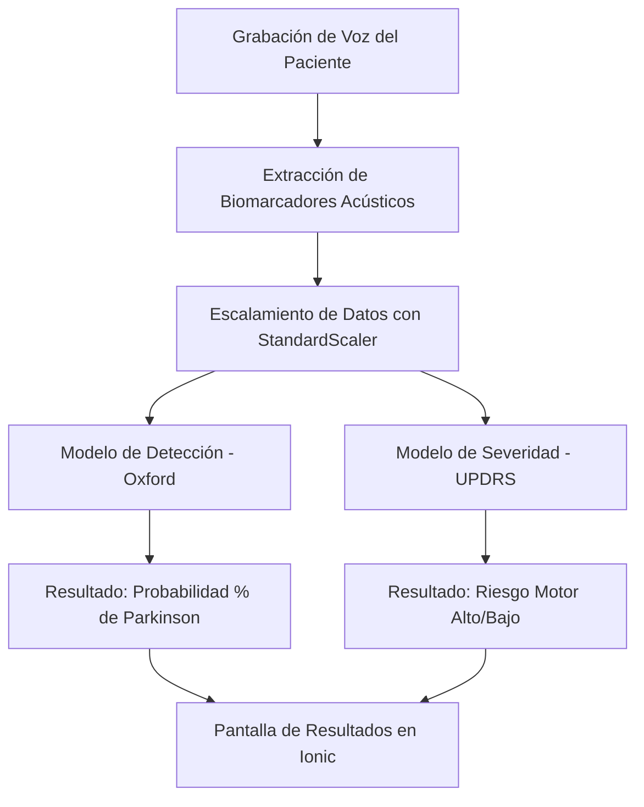

# Guía de Estudio: Machine Learning en S-Park 🧠🎙️

Esta guía fue diseñada como material didáctico para explicar de forma sencilla, paso a paso, cómo funciona el backend de Inteligencia Artificial de la aplicación **S-Park**, qué tecnologías utiliza y cómo se evalúa su rendimiento clínico.

---

## 1. El Problema: ¿Qué resuelve la IA de S-Park?
El Parkinson es una enfermedad neurodegenerativa que afecta el sistema motor. Uno de los primeros síntomas es la **disfonía** (alteración en la voz debido a la rigidez laríngea). 

**S-Park** utiliza algoritmos de Machine Learning para analizar grabaciones de voz y resolver dos problemas distintos en el backend:
1. **Detección (¿Tiene o no Parkinson?):** Clasificación binaria (Sano = 0, Parkinson = 1).
2. **Severidad (¿Qué tan grave es el síntoma motor?):** Clasificación de la escala unificada de UPDRS (Bajo Riesgo = 0, Alto Riesgo = 1).

---

## 2. Los Dos Conjuntos de Datos (Datasets)

Para entrenar la IA, se utilizaron dos datasets de referencia médica internacional:

### A. Dataset de Oxford (Detección)
* **Origen:** Grabaciones acústicas de 31 sujetos en laboratorios de la Universidad de Oxford.
* **Tamaño:** 195 filas (pequeño pero muy limpio).
* **Objetivo:** Identificar si la firma acústica de la voz corresponde a un paciente sano o enfermo.

### B. Dataset de UPDRS (Severidad)
* **Origen:** Estudio de telemonitoreo a distancia de 42 pacientes con Parkinson durante 6 meses en sus hogares.
* **Tamaño:** 5,875 filas (grande y representativo del uso cotidiano).
* **Objetivo:** Clasificar el nivel de afectación motor en las cuerdas vocales (Bajo vs Alto).

---

## 3. Las Librerías Clave (Nuestra Caja de Herramientas 🛠️)

El código de IA está programado en Python utilizando las siguientes librerías de estándar industrial:
* **`pandas`:** Carga y limpia los archivos de datos (`.csv`) convirtiéndolos en tablas interactivas en memoria (DataFrames).
* **`numpy`:** Realiza los cálculos matemáticos y matriciales rápidos a bajo nivel.
* **`scikit-learn` (sklearn):** Contiene las herramientas para procesar los datos (`StandardScaler`), entrenar los modelos (`RandomForestClassifier`, `SVC`), evaluar métricas y realizar validación cruzada.
* **`xgboost`:** Habilita el clasificador XGBoost, un algoritmo avanzado de árboles secuenciales de alto rendimiento.
* **`openpyxl`:** Permite a Python generar, estructurar y escribir en archivos de hojas de cálculo de Excel (`.xlsx`).
* **`matplotlib` & `seaborn`:** Diseñan y guardan los gráficos de las matrices de confusión en archivos de imagen.

---

## 4. El Flujo de Datos (¿Cómo viaja la voz hasta el resultado? 🔄)

### ¿Por qué escalamos los datos (`StandardScaler`)?
Los biomarcadores acústicos tienen escalas muy diferentes. Por ejemplo, la frecuencia promedio de la voz puede ser de `150.0 Hz` mientras que el "jitter" (perturbación del tono) es de `0.003`. 
Si le entregamos estos números crudos a la IA, el algoritmo creerá que la frecuencia es 50,000 veces más importante solo porque su número es más grande. El escalador **normaliza** todas las variables para que tengan media 0 y desviación estándar 1, asegurando que compitan en igualdad de condiciones.

---

## 5. Explicación Sencilla de los Modelos (Algoritmos) Evaluados

Evaluamos cuatro tipos de algoritmos para encontrar el ideal:

### A. Random Forest (Bosques Aleatorios 🌲) - *El Modelo Ganador*
* **Cómo funciona:** Imagina que tienes 100 expertos (árboles de decisión). A cada uno le das una muestra aleatoria de los datos y una pregunta acústica. Cada experto da su veredicto. Al final, se hace una votación democrática y la mayoría define el resultado.
* **Ventaja:** Es sumamente estable, maneja muy bien el ruido de grabaciones caseras y no se sobreajusta fácilmente.

### B. Support Vector Machines (SVM - Máquinas de Soporte Vectorial ⚙️)
* **Cómo funciona:** Intenta trazar una línea o frontera imaginaria (hiperplano) en un espacio multidimensional que separe lo más lejos posible a los sanos de los enfermos.
* **Desventaja:** Le va mal cuando los datos están muy desbalanceados (muchos sanos y pocos enfermos), tendiendo a clasificar todo en la clase mayoritaria.

### C. Gradient Boosting (Aumento de Gradiente 🚀)
* **Cómo funciona:** Entrena árboles secuencialmente. El primer árbol hace predicciones con muchos errores; el segundo árbol se entrena específicamente para corregir los errores del primero; el tercero corrige al segundo, y así sucesivamente.
* **Desventaja:** Tiende a memorizar los datos de entrenamiento (sobreajuste) si el dataset es pequeño o ruidoso.

### D. XGBoost (Boosting Extremo ⚡)
* **Cómo funciona:** Es una versión ultra-optimizada y matemática del Gradient Boosting, diseñada para ser muy rápida e implementar penalizaciones de regularización para evitar sobreajuste.

---

## 6. Métricas de Evaluación explicadas "con manzanas" 📊

Para saber qué tan buena es nuestra IA, no basta con decir "acertó mucho". Medimos métricas específicas en el conjunto de prueba (**Test Set**):

### A. Accuracy (Exactitud)
* **Qué es:** ¿Qué porcentaje de predicciones totales fueron correctas?
* **Fórmula:** $\frac{\text{Aciertos Totales}}{\text{Total de Muestras Evaluadas}}$
* **Ejemplo:** Si evalúa 100 voces y acierta en 95, la exactitud es del 95%.

### B. Precision (Precisión)
* **Qué es:** De todos los pacientes que el modelo **etiquetó** con Parkinson, ¿cuántos realmente tenían la enfermedad?
* **Objetivo:** Evitar las falsas alarmas (Falsos Positivos).
* **Fórmula:** $\frac{\text{Verdaderos Positivos}}{\text{Verdaderos Positivos} + \text{Falsos Positivos}}$

### C. Recall / Sensibilidad (¡La más importante en salud! 🩺)
* **Qué es:** De todos los pacientes que **de verdad** tienen Parkinson, ¿a cuántos logró detectar el modelo?
* **Objetivo:** Evitar que un paciente enfermo se vaya a casa creyendo que está sano (Falsos Negativos).
* **Fórmula:** $\frac{\text{Verdaderos Positivos}}{\text{Verdaderos Positivos} + \text{Falsos Negativos}}$

### D. F1-Score
* **Qué es:** Es el promedio armónico y balanceado entre la **Precision** y el **Recall**. Si el F1-Score es alto, significa que el modelo es equilibrado y seguro.

---

## 7. La Matriz de Confusión: La Tabla de la Verdad 🎯

Es una tabla de $2 \times 2$ que muestra dónde acertó y dónde se equivocó el modelo. 

| | Predicción Sano (0) | Predicción Parkinson (1) |
|---|---|---|
| **Valor Real Sano (0)** | **Verdadero Negativo (TN):** El modelo dijo sano y realmente está sano. (Acierto) | **Falso Positivo (FP):** El modelo dio falsa alarma de enfermedad. (Error) |
| **Valor Real Parkinson (1)**| **Falso Negativo (FN):** El modelo dijo sano pero el paciente tiene Parkinson. (Error clínico grave) | **Verdadero Positivo (TP):** El modelo detectó correctamente la enfermedad. (Acierto) |

---

## 8. ¿Qué es la Validación Cruzada (Cross-Validation)? 🔄

Si solo dividimos los datos una vez en 80% entrenamiento y 20% prueba, podríamos tener "suerte" y que nos toque una partición de prueba muy fácil, arrojando un 100% artificial.

Para evitar esto, usamos **Validación Cruzada de 5 Pliegues (5-Fold CV)**:
1. Dividimos los datos de entrenamiento en 5 bloques iguales.
2. Hacemos 5 iteraciones. En cada una, usamos 4 bloques para entrenar y 1 bloque para validar.
3. El bloque de validación va rotando en cada iteración.
4. Al final, promediamos los resultados de las 5 pruebas. Esto nos da la **exactitud real y estable** del modelo.

---

## 9. Las Divisiones de Datos (90-10, 80-20, 70-30)

Evaluamos tres formas de dividir nuestros datos históricos:
* **90-10:** 90% para entrenar y 10% para probar.
* **80-20:** 80% para entrenar y 20% para probar (El estándar clásico).
* **70-30:** 70% para entrenar y 30% para probar.

**Conclusión del estudio:** A mayor porcentaje de datos destinados al entrenamiento (90-10), mejor aprende el algoritmo (obteniendo un **95% de Exactitud** en Random Forest), ya que aprovecha más la variabilidad de las muestras acústicas sin llegar a sobreajustarse.
